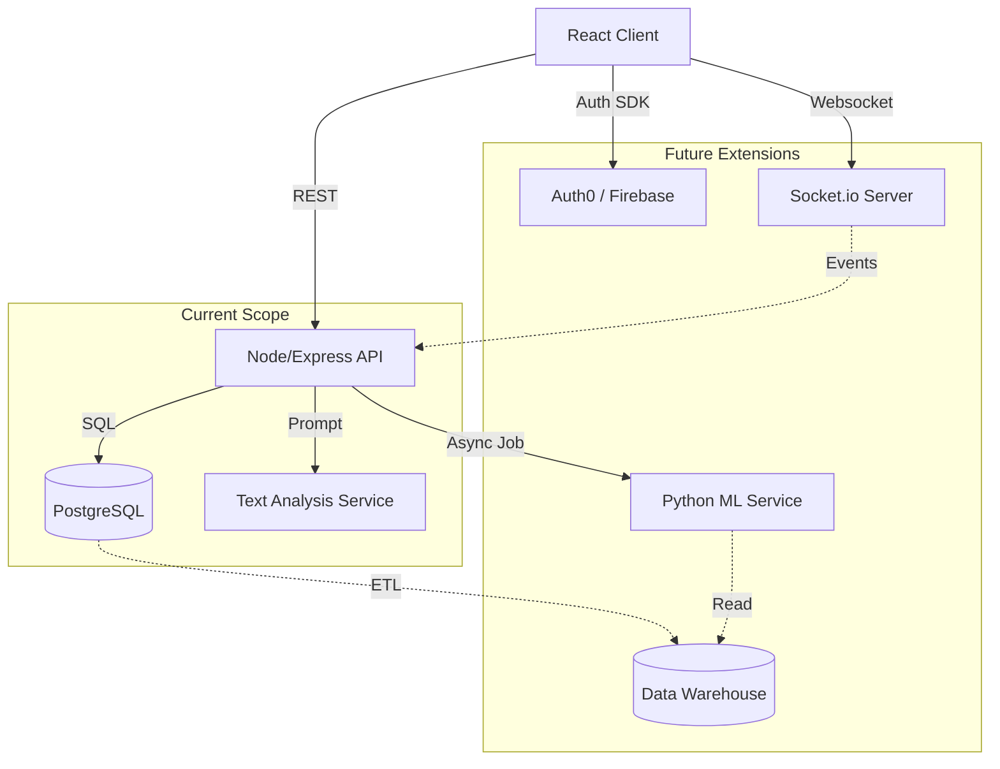

# Future Architectural Roadmap & Extension Points

This document outlines the strategic technical roadmap for **Nexus Ops (Sapthagiri NPS University System)**. It defines the boundary between the current prototype architecture and the required modules for a production-scale deployment.

---

## 1. Authentication & Security Layer

### Current State
*   **Mechanism:** Mock Authentication.
*   **Transport:** Custom headers (`x-mock-user-id`, `x-mock-role`) passed from Frontend to Backend.
*   **Trust Model:** The backend blindly trusts the headers provided by the client.

### Future State: JWT & OAuth 2.0
*   **Protocol:** Implement **OpenID Connect (OIDC)**.
*   **Strategy:**
    1.  **Identity Provider (IdP):** Integrate with Auth0, Firebase Auth, or Google Workspace (University email).
    2.  **Tokens:**
        *   Frontend receives a short-lived **Access Token (JWT)** upon login.
        *   Backend verifies the JWT signature using the IdP's public key (JWKS).
    3.  **Middleware:** Replace `mockAuthMiddleware` with `jwtVerifierMiddleware`.
*   **RBAC (Role-Based Access Control):**
    *   Move role definitions from client-side mock constants to the JWT claims (e.g., `scope: "admin:write"`).

### Integration Point
*   **Backend:** `src/middleware/authMiddleware.ts` (currently missing/mock) → Update to use `express-jwt`.
*   **Frontend:** `src/context/AuthContext.tsx` → Replace mock state with IdP SDK (e.g., `@auth0/auth0-react`).

---

## 2. Real-Time Communication Layer

### Current State
*   **Mechanism:** Request-Response (REST API).
*   **Updates:** User must refresh or rely on optimistic UI updates to see changes (e.g., Ticket status change).

### Future State: Websockets / Event Bus
*   **Architecture:** Event-Driven Architecture.
*   **Technology Options:**
    *   **Socket.io:** For bi-directional communication (ideal for chat, live location).
    *   **Server-Sent Events (SSE):** For uni-directional updates (ideal for notification feeds).
*   **Use Cases:**
    *   **Live Notifications:** "Prof. X just assigned you a task" (Push immediately).
    *   **Ticket Collaboration:** Live typing indicators or comments on infrastructure tickets.
    *   **Emergency Broadcasts:** Immediate full-screen alerts for "Urgent" announcements.

### Integration Point
*   **Backend:** New service `src/services/socketService.ts` hooking into the HTTP server instance.
*   **Frontend:** `src/services/realtimeService.ts` utilizing a singleton connection provider.

---

## 3. Advanced Analytics & Machine Learning

### Current State
*   **Analytics:** Basic SQL Aggregations (`COUNT`, `AVG`) executed directly on the operational database (`PostgreSQL`).
*   **AI:** External text-analysis service called directly for ticket description analysis.

### Future State: Data Warehouse & ML Pipeline
*   **Separation of Concerns:** Move heavy analytical queries off the transactional DB (OLTP) to an analytical DB (OLAP).
*   **Pipeline:**
    1.  **ETL:** Nightly jobs (e.g., BullMQ) to aggregate `attendance_records` and `marks` into a `student_performance_history` table.
    2.  **Predictive Modeling (Python/FastAPI):**
        *   **Dropout Risk:** Logistic regression model using *Attendance* + *Assignment Submission Rate* + *Mid-term Marks*.
        *   **Infrastructure Failure:** Time-series forecasting on ticket frequency per building.
*   **AI Integration:**
    *   Move from synchronous API calls to an asynchronous job queue (Redis/Bull) to prevent API timeouts during peak load.

### Integration Point
*   **Infrastructure:** Spin up a separate Python Microservice for ML inference.
*   **Backend:** `src/services/mlService.ts` communicates via gRPC or internal REST to the Python service.

---

## 4. 3D Digital Twin & IoT Overlay

### Current State
*   **Visualization:** 2D SVG Map + CSS 3D Transforms.
*   **Data:** Static coordinates in `constants.ts`.

### Future State: WebGL & IoT Integration
*   **Technology:** **React Three Fiber (R3F)** / **Three.js**.
*   **Assets:** Load `.gltf` / `.glb` models of the campus buildings.
*   **IoT Layer:**
    *   Integrate with Building Management Systems (BMS).
    *   **Data Points:** Live temperature, HVAC status, Occupancy sensors.
    *   **Visuals:** Heatmaps overlaid on the 3D floor plans.

### Integration Point
*   **Frontend:** Replace `CampusMap.tsx` with a `Canvas` context.
*   **Data:** Extend `Building` entity in SQL to include `model_url` and `iot_device_ids`.

---

## Architecture Diagram (Abstract)

